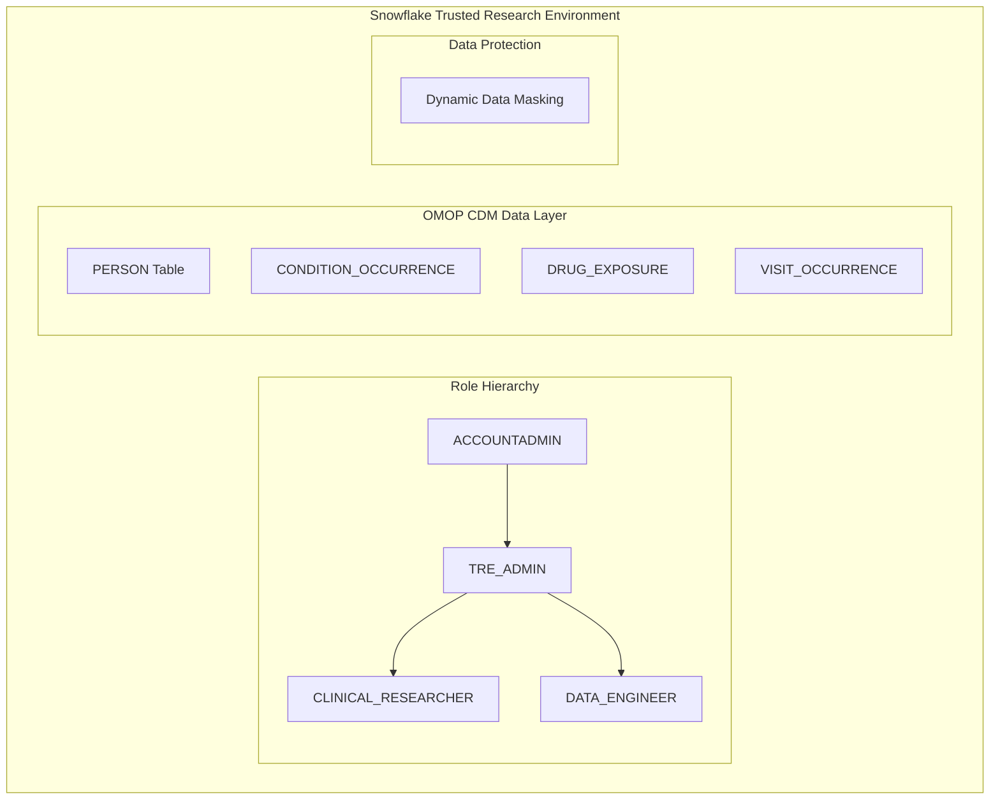

I'll help you build a Trusted Research Environment (TRE) powered by Snowflake. Let me research the components and gather the necessary information.Let me get more details on TRE RBAC patterns and the OMOP CDM structure:Let me get more details on TRE roles and the Five Safes framework:Let me fetch the actual skill file contents from GitHub:I have gathered comprehensive information. Let me create the detailed implementation plan for your Trusted Research Environment.I've researched and prepared a comprehensive plan for your TRE. Let me present it in a structured format:

---

# Trusted Research Environment (TRE) on Snowflake - Implementation Plan

## Architecture Overview

---

## Tasks

### Task 1: Create OMOP CDM Sample Data
**Database structure:**
- `TRE_HEALTHCARE_DB.OMOP_CDM`
- Tables: PERSON, OBSERVATION_PERIOD, VISIT_OCCURRENCE, CONDITION_OCCURRENCE, DRUG_EXPOSURE, PROCEDURE_OCCURRENCE
- ~100 synthetic patients with realistic clinical data

### Task 2: Download Clinical Trial Protocol Skill
From: `github.com/sfc-gh-beddy/coco-healthcare-skills`
- SKILL.md orchestrator for clinical trial protocol generation
- Sample size calculator scripts
- FDA guidance research capabilities

### Task 3: Implement TRE RBAC Roles
Based on **SATRE Specification** and **Five Safes Framework**:

| Role | Persona | Access Level |
|------|---------|--------------|
| TRE_ADMIN | TRE Operator | Full admin |
| CLINICAL_RESEARCHER | Data Analyst | Full patient data |
| DATA_ENGINEER | Data Steward | Masked PII |

### Task 4: Create Data Masking Policies
Mask sensitive columns for DATA_ENGINEER role:
- `person_source_value` → "***REDACTED***"
- `birth_datetime` → Year only
- `location_id` → Hidden

### Task 5: Build Streamlit Application
Dual-persona app with:
- Role selector (Researcher vs Engineer)
- Patient demographics explorer
- Condition analysis dashboard
- Drug exposure reports
- Visual badges showing access level

### Task 6: Test and Validate

---

## Research Sources

**TRE Best Practices:**
- SATRE Specification (Standard Architecture for TREs)
- UK Five Safes Framework (Safe People, Projects, Data, Settings, Outputs)
- AWS TRE Implementation Patterns

**OMOP CDM:**
- OHDSI OMOP CDM v5.3 specification
- Core clinical tables for healthcare analytics

---

Does this plan look good? Would you like me to proceed with implementation, or would you like to adjust any aspects (e.g., number of sample patients, specific tables, masking strategy)?

